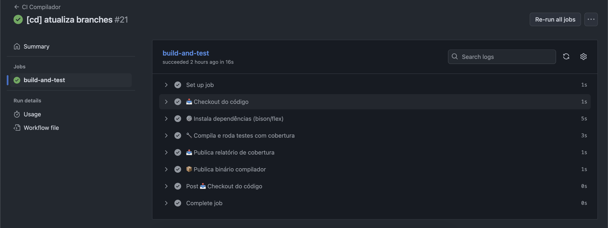
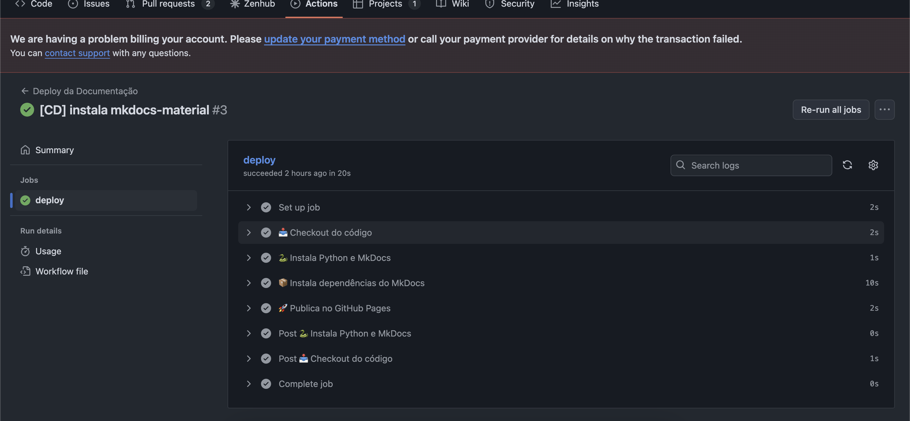

# Workflows de CI/CD

Este documento descreve os dois workflows automatizados configurados no repositório GitHub do projeto: **um para testes e cobertura do compilador** e outro para **deploy da documentação no GitHub Pages**.

---

## 1. CI Compilador (`.github/workflows/ci.yml`)

Esse workflow é executado a cada `push` para qualquer branch. Ele garante que o compilador está funcionando corretamente e que os testes foram executados com sucesso.

### Etapas:

```yaml
on:
  push:
    branches: ["**"]
```

Executa o workflow para qualquer branch modificada.

### Passos executados:



- **Checkout do código**
  ```yaml
  uses: actions/checkout@v4
  ```

- **Instalação de dependências**
  ```bash
  sudo apt-get update && sudo apt-get install -y bison flex
  ```

- **Execução dos testes com cobertura**
  ```bash
  make coverage
  ```


- **Publicação dos artefatos**
  ```yaml
  - name: 📤 Publica relatório de cobertura
    path: compiler-source/cobertura.txt

  - name: 📦 Publica binário compilador
    path: compiler-source/compilador
  ```

Esses artefatos ficam disponíveis na aba "Actions" do GitHub como evidência da execução automatizada.


---

## 2. Deploy da Documentação (`.github/workflows/deploy.yml`)

Este workflow é responsável por gerar e publicar a documentação do projeto automaticamente no GitHub Pages sempre que houver um `push` para a branch `main`.



### Acionamento:

```yaml
on:
  push:
    branches:
      - main
      - fix-ultimo
```

### Permissão:

```yaml
permissions:
  contents: write
```

Essa permissão é necessária para permitir que o MkDocs publique diretamente no branch `gh-pages`.

### Etapas:

- **Checkout do código**
  ```yaml
  uses: actions/checkout@v4
  ```

- **Instalação do Python e MkDocs**
  ```yaml
  uses: actions/setup-python@v5
  with:
    python-version: '3.11'

  pip install mkdocs mkdocs-material
  ```

- **Deploy automático no GitHub Pages**
  ```bash
  mkdocs gh-deploy --force
  ```

---

## Benefícios Gerais dos Workflows

- **Automação completa** da verificação e entrega contínua
- **Feedback imediato** sobre quebras e regressões
- **Documentação sempre atualizada**
- **Armazenamento automático de artefatos úteis (binários, cobertura)**

Esses workflows promovem um ciclo de desenvolvimento seguro, confiável e padronizado para toda a equipe.

