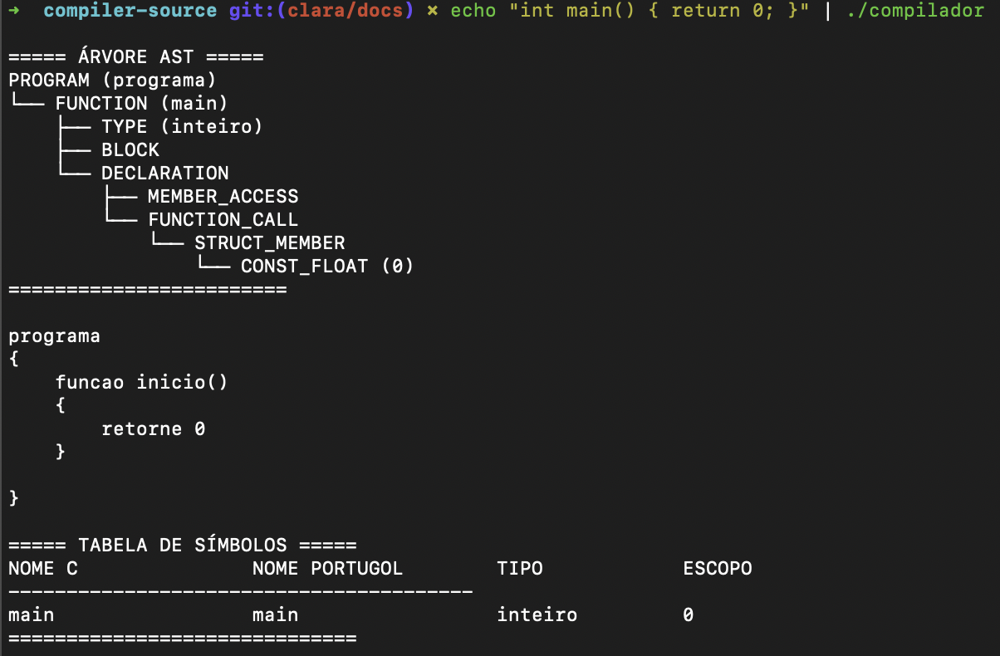
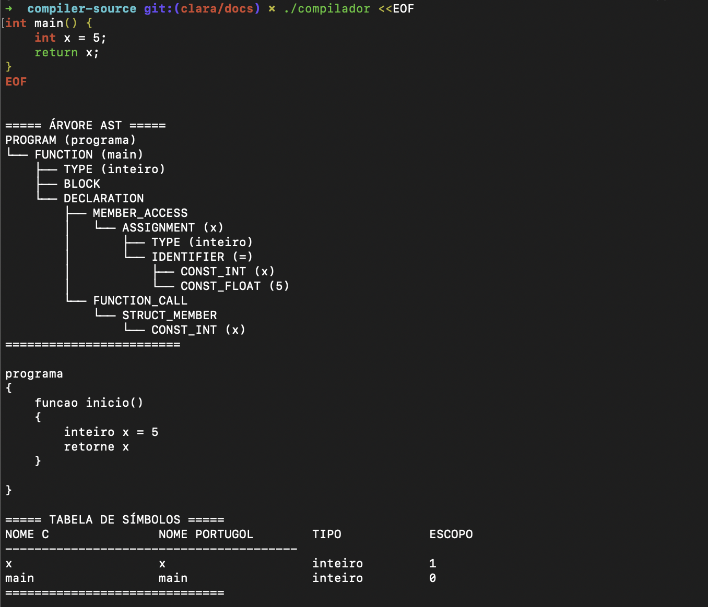

# Instalação

Este guia apresenta as instruções para instalar e executar o **Compilador de C para Portugol** em diferentes sistemas operacionais. O projeto pode ser compilado localmente com `make`.

---

## Pré-requisitos

Antes de instalar o compilador, certifique-se de que seu sistema possui os seguintes componentes instalados:

- **GCC** (compilador C)
- **Flex** (versão recomendada: 2.6.4)
- **Bison** (versão recomendada: 3.8.2)
- **Make** (automatizador de build)

Para instalar em distribuições baseadas em Debian (como Ubuntu):

```bash
sudo apt update
sudo apt install build-essential flex bison -y
```

Para instalar em MACOS, Instale as dependências com Homebrew:

```bash
brew install flex bison
```

No Windows, recomenda-se o uso do **WSL** (Windows Subsystem for Linux) para garantir compatibilidade com o ambiente de desenvolvimento.

### Usando WSL:

1. Instale o WSL e abra um terminal Ubuntu.

```bash
sudo apt update
sudo apt install build-essential flex bison -y
```

---

## Instalação

1. Clone o repositório:

```bash
git clone https://github.com/ccarlaa/Compiladores---Grupo-5.git
cd Compiladores---Grupo-5/compiler-source
```

2. Compile o projeto:

```bash
make
```

3. Execute um teste de verificação:

Você pode testar o compilador diretamente no terminal com um código simples:

```bash
echo "[CÓDIGO TESTE]" | ./compilador
```

Exemplo:


```bash
echo "int main() { return 0; }" | ./compilador
```

A saída esperada é a impressão da Árvore AST, o código compilado e a tabela de símbolos:



Ou, para códigos maiores e com múltiplas linhas, use:

```bash
./compilador <<EOF
[CÓDIGO TESTE]
EOF
```

Exemplo:
```bash
./compilador <<EOF
int main() {
    int x = 5;
    return x;
}
EOF

```

A saída esperada é a impressão da Árvore AST, o código compilado e a tabela de símbolos:



---

## Solução de Problemas

Caso ocorra algum erro durante a instalação:

* Verifique se todas as dependências estão instaladas corretamente.
* Certifique-se de que os scripts tenham permissão de execução:

```bash
chmod +x compilar-linux.sh compilar-macos.sh docker-run.sh
```

* Consulte mensagens de erro exibidas no terminal para identificar a causa.
* No caso de problemas com o `make`, execute `make clean` antes de recompilar.